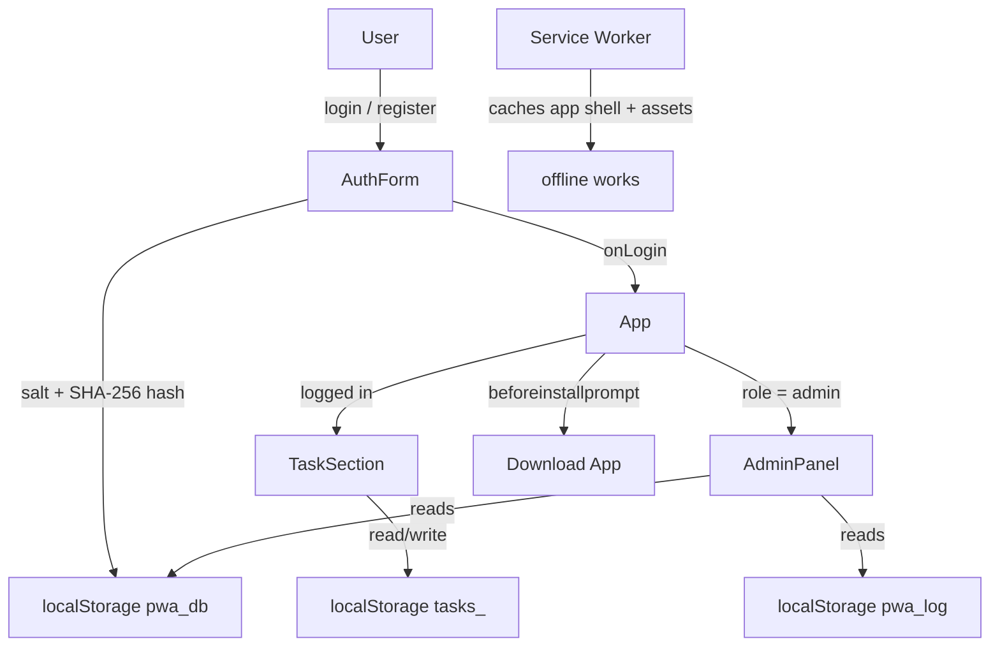
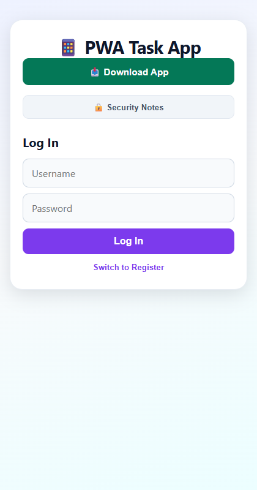
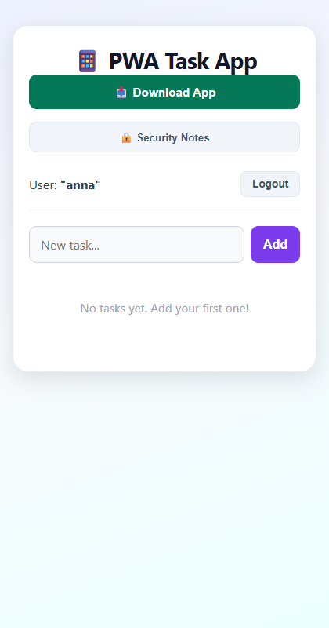
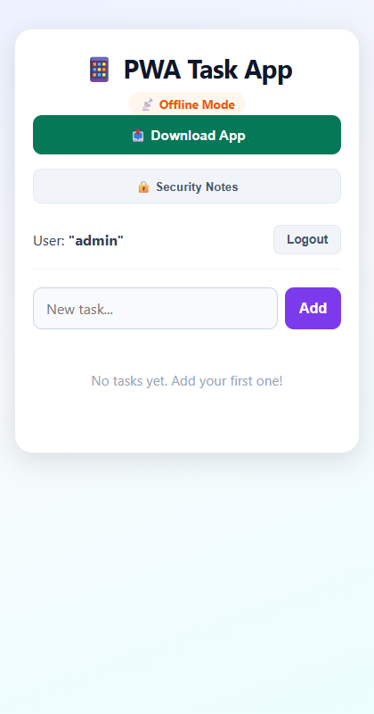

# 📱 PWA Task App

A secure, offline-first, installable task manager built with React + Vite, hardened against the OWASP Top 10.

## What it is / who it's for

A small but real Progressive Web App (PWA): sign up, keep a task list, install it on your phone, and use it offline. Built as a **Track S capstone** — the goal is not just "it runs", but *it is hardened*: every input is validated, output is escaped, passwords are never stored, and the security model is documented.

**Live link:** https://vikkyyyt1-hash.github.io/PWA/

## Features

- Installable PWA (manifest + service worker + "Download App" button)
- Works **offline** (verified by an automated browser test)
- Local accounts: the **first user is admin**, others are regular users
- **Admin Panel**: all users, task counts, and a local security audit log
- Input validation + sanitisation, XSS-safe output (React escaping)
- Salted password hashing — plaintext never touches `localStorage`
- Lighthouse: Performance / Accessibility / Best Practices / SEO = **100/100/100/100**

## How to run it

```bash
# 1. clone
git clone https://github.com/vikkyyyt1-hash/PWA.git
cd PWA

# 2. install dependencies
npm install

# 3. run the dev server (http://localhost:5173)
npm run dev

# 4. production build + preview
npm run build
npm run preview
```

First registered user = **admin** → the Admin Panel appears below the task list.

## How it works



Everything lives in the browser (`localStorage`) — there is no server. Components are small and single-purpose: `App` (state + PWA), `AuthForm` (accounts), `TaskSection` (tasks), `AdminPanel` (admin view), `security.js` (hashing + safe storage helpers).

## Screenshots

| Log in | Tasks (offline) | Admin Panel |
|---|---|---|
|  |  |  |

## 🔒 Security model

What we defend against and how — see [docs/security-notes.md](docs/security-notes.md) for the full Day 8–12 audit.

| Threat | Defence |
|---|---|
| XSS | React escapes all output; automated test proves `<script>` stays text |
| Password leaks | Salted SHA-256 hash only, never plaintext |
| Bad / malicious input | Validate + sanitise everything (`username`, `password`, `task`) |
| Broken access control | Admin role comes only from the account record; panel never renders for non-admins |
| Outdated deps | `npm audit` → 0 vulnerabilities |
| Insecure transport | HTTPS (GitHub Pages) + CSP, `nosniff`, `no-referrer` headers |

**Known limits (documented, not hidden):** auth is client-side (a demo — `localStorage` is readable by anyone with device access) and there is no remote logging. These are trade-offs of a static PWA, tracked in issues #12 and #13.

## Tests

```bash
npm run check-security    # automated XSS test in Chrome (proves input stays text)
npm run check-offline     # real offline test in Chrome (app must render without network)
npm run check-lighthouse  # Lighthouse audit against the live site (100/100/100/100)
npm run screenshots       # regenerate the README screenshots
```

## Project structure

```text
├── src/                  # React components + security helpers
├── public/               # manifest, icons, service worker
├── scripts/              # automated checks (offline, security, lighthouse, screenshots)
├── docs/                 # security notes, issues board, lighthouse report, screenshots
└── index.html            # app shell (includes CSP meta headers)
```

Made for the Web · Games · Mobile · Cybersecurity programme (3-week remote curriculum, August 2026).
